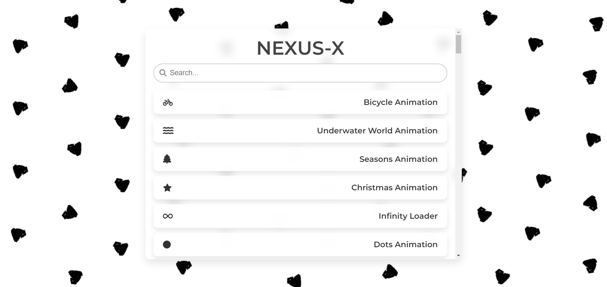

# NEXUS-X

NEXUS-X is a curated collection of interactive web animations, games, and mini-applications built entirely with HTML, CSS, and JavaScript. It serves as a showcase and hub for various creative projects, hosted on GitHub Pages.

## Live Demo

Check out the live version here: [NEXUS-X](https://binaryvortex.github.io/NEXUS-X/)

## Screenshot



## Features

- **Search Functionality**: Easily find animations and projects using the built-in search bar.
- **Diverse Collection**: Over 150+ unique animations including:
  - Nature animations (Bicycle, Underwater, Volcano, etc.)
  - Space and futuristic themes (Rocket, Alien, Universe)
  - Games (Tic-Tac-Toe, Snake, Chess, etc.)
  - Tools (Calculator, Weather App, Password Generator, etc.)
  - And much more!

- **Responsive Design**: Optimized for various screen sizes.
- **No Dependencies**: Pure vanilla JavaScript, no external libraries required (except Font Awesome for icons).

## Technologies Used

- **HTML**: Structure and content
- **CSS**: Styling and animations
- **JavaScript**: Interactivity and search functionality
- **Font Awesome**: Icons

## Language Composition

- HTML: ~58%
- CSS: ~23%
- JavaScript: ~3%

## How to View Locally

1. Clone the repository:
   ```
   git clone https://github.com/BinaryVortex/NEXUS-X.git
   ```
2. Open `index.html` in your web browser.

## Contributing

This project is a personal collection. If you'd like to contribute or suggest new animations, feel free to open an issue or submit a pull request.

## License

This project is open source and available under the [MIT License](LICENSE).

## About the Creator

Created by [BinaryVortex](https://github.com/BinaryVortex) as a portfolio of web development projects.

---

*Explore the universe of web animations at NEXUS-X!*
